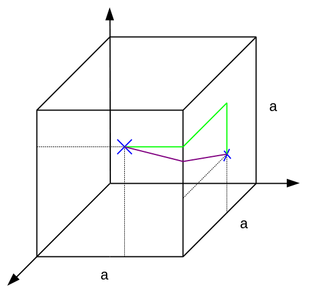

# Instalatéři
## Zadání
Úkolem je vytvořit program, který dokáže určit optimální délku potrubí.

Předpokládáme, že máme místnost ve tvaru krychle o délce strany a. Na stěnách místnosti jsou dvě místa, která chceme propojit potrubím. Úkolem je určit, jaká bude nejmenší potřebná délka potrubí. Uvažujeme 2 varianty propojení:

* trubky ve zdech. Trubky lze umístit pouze rovnoběžně s hranami krychle (důvodem je omezený repertoár spojovacích armatur),
* hadice ve zdech. Hadice lze umístit do zdí v libovolném směru, nemusí být rovnoběžné s hranami (hadice nepotřebují armatury, lze je ohýbat).

Vstupem programu je velikost místnosti (rozměr krychle a) a zadání 2 bodů. Každý bod je zadaný pomocí souřadnic x, y a z. Zadávané hodnoty jsou celá čísla. Krychle je umístěna jedním vrcholem do počátku souřadného systému a její hrany jsou rovnoběžné s osami x/y/z.



Výstupem programu je vypočtená potřebná délka trubek a vypočtená potřebná délka hadice. Při výpočtu zanedbáváme délku ohybu. Program zobrazí vypočtené hodnoty ve formátu dle ukázky. Za každým řádkem výpisu je znak odřádkování (`\n`).

Program musí být schopen detekovat nesprávný vstup. Pokud je na vstupu nesmyslné zadání, program to zjistí, vypíše chybové hlášení a ukončí se. Formát chybového hlášení je uveden v ukázce níže. Pozor, za případným chybovým hlášením je odřádkování (`\n`). Chybová hlášení zasílejte na standardní výstup (`printf`), nezasílejte jej na chybový výstup. Za chybu je považováno:

* nečíselná, nulová nebo záporná hodnota velikosti místnosti,
* nečíselná hodnota souřadnice při zadávání bodů,
* zadaný bod neleží v žádné stěně,
* bod leží příliš blízko rohu místnosti (za správně zadané považujeme pouze body ležící alespoň 20 cm od hrany).

Při programování si dejte pozor na přesnou podobu výpisů. Výstup Vašeho programu kontroluje stroj, který požaduje přesnou shodu výstupů Vašeho programu s výstupy referenčními. Za chybu je považováno, pokud se výpis liší. I chybějící nebo přebývající mezera/odřádkování je považováno za chybu. Abyste tyto problémy rychle vyloučili, použijte přiložený archiv se sadou vstupních a očekávaných výstupních dat. Podívejte se na videotutoriál (edux -> výuková videa), jak testovací data použít a jak testování zautomatizovat.

Váš program bude spouštěn v omezeném testovacím prostředí. Je omezen dobou běhu (limit je vidět v logu referenčního řešení) a dále je omezena i velikost dostupné paměti (ale tato úloha by ani s jedním omezením neměla mít problém). Testovací prostředí dále zakazuje používat některé "nebezpečné funkce" -- funkce pro spouštění programu, pro práci se sítí, ... Pokud jsou tyto funkce použité, program se nespustí. Možná ve svém programu používáte volání:

```c
int main ( int argc, char * argv [] )
{
 
  ...
     
  system ( "pause" ); /* aby se nezavrelo okno programu */
  return 0;
}
```

Toto nebude v testovacím prostředí fungovat - je zakázáno spouštění jiného programu. (I pokud by se program spustil, byl by odmítnut. Nebyl by totiž nikdo, kdo by pauzu "odmáčkl", program by čekal věčně a překročil by tak maximální dobu běhu.) Pokud tedy chcete zachovat pauzu pro testování na Vašem počítači a zároveň chcete mít jistotu, že program poběží správně, použijte následující trik:

```c
int main ( int argc, char * argv [] )
{
 
  ...

#ifndef __PROGTEST__
  system ( "pause" ); /* toto progtest "nevidi" */
#endif /* __PROGTEST__ */
  return 0;
} 
```
## Ukázka práce programu
Ukázková data jsou uložena ve složce [_sample_](sample).

## Poznámky
* Řešení se liší podle toho, v jakých stěnách leží propojované body. Celkem může nastat 6*6=36 variant vzájemných poloh. Program, který by každou takovou variantu řešil samostatně, by byl nesmyslně dlouhý. Snažte se rozmyslet strukturu programu tak, abyste počet různých větví programu co nejvíce omezili. Využitím symetrie lze dojít k počtu 6 různých větví programu.
* Vypočtená délka hadice by měla být stejná jako referenční. Při porovnávání je ale tolerována malá číselná odchylka menší než 0.1 promile.
* Znak odřádkování (\n) je i za poslední řádkou výstupu (i za případným chybovým hlášením).